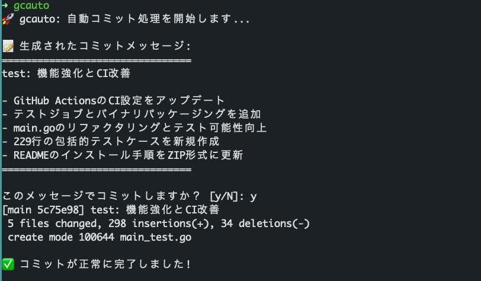

# gcauto

[](https://github.com/shivase/gcauto/actions/workflows/ci.yml)
[](https://opensource.org/licenses/MIT)

自動でGitコミットメッセージを生成するCLIツール

## 概要

gcautoは、ステージングされたGitの変更を分析し、AIを使用してConventional Commitsフォーマットの日本語コミットメッセージを自動生成するツールです。



## 機能

- ステージングされた変更を自動で分析
- Conventional Commitsフォーマットに準拠したコミットメッセージを生成
- 日本語でのわかりやすいコミットメッセージ
- コミット前の確認プロンプト
- 使用するAIモデルを選択可能（Claude, Gemini）

## 必要条件

- Go 1.22以上
- Git
- 使用するAIモデルに応じたCLIツールがインストールされ、設定済みであること
  - [Claude CLI](https://docs.anthropic.com/claude/docs/claude-cli)
  - [Gemini CLI](https://ai.google.dev/tutorials/gemini_cli_quickstart?hl=ja)
- [mise](https://mise.jdx.dev/)（開発時のタスク管理用、オプション）

## 使い方

```bash
# Gitの変更をステージング
git add .

# gcautoを実行（デフォルトはClaude）
gcauto

# Geminiを使用する場合
gcauto --model gemini
# または
gcauto -m gemini

# コミットメッセージが自動生成され、確認プロンプトが表示されます
```

## インストール

### リリースバイナリから（推奨）

[Releases](https://github.com/shivase/gcauto/releases)ページから、お使いのOS/アーキテクチャに対応したZIPファイルをダウンロードしてください。

```bash
# macOS (Intel)
curl -L https://github.com/shivase/gcauto/releases/latest/download/gcauto-darwin-amd64.zip -o gcauto.zip

# macOS (Apple Silicon)
curl -L https://github.com/shivase/gcauto/releases/latest/download/gcauto-darwin-arm64.zip -o gcauto.zip

# Linux (x86_64)
curl -L https://github.com/shivase/gcauto/releases/latest/download/gcauto-linux-amd64.zip -o gcauto.zip

# Linux (ARM64)
curl -L https://github.com/shivase/gcauto/releases/latest/download/gcauto-linux-arm64.zip -o gcauto.zip

# ZIPファイルを解凍
unzip gcauto.zip

# 実行権限を付与してインストール
chmod +x gcauto
sudo mv gcauto /usr/local/bin/

# 一時ファイルを削除
rm gcauto.zip
```

### ソースからビルド

```bash
# リポジトリをクローン
git clone https://github.com/shivase/gcauto.git
cd gcauto

# miseを使用する場合（推奨）
mise run build
sudo cp build/gcauto /usr/local/bin/

# または直接goコマンドを使用
go build -o gcauto
sudo mv gcauto /usr/local/bin/
```

### 手動インストール

```bash
# ビルド
go build -o gcauto

# 実行権限を付与
chmod +x gcauto

# パスの通った場所に移動
sudo mv gcauto /usr/local/bin/
```

## コミットメッセージの形式

gcautoは[Conventional Commits](https://www.conventionalcommits.org/ja/v1.0.0/)仕様に準拠したコミットメッセージを生成します：

```
<type>[(scope)]: <description>

[body]

[footer]
```

利用可能なタイプ：
- `feat`: 新機能の追加
- `fix`: バグ修正
- `docs`: ドキュメントのみの変更
- `style`: コードの意味に影響しない変更（空白、フォーマット、セミコロンの欠落など）
- `refactor`: バグ修正でも機能追加でもないコード変更
- `perf`: パフォーマンス改善のためのコード変更
- `test`: テストの追加や修正
- `build`: ビルドシステムや外部依存関係に影響する変更
- `ci`: CI設定ファイルとスクリプトへの変更
- `chore`: その他の変更（srcやtestフォルダーの変更を含まない）
- `revert`: 以前のコミットを取り消す

## 開発

### セットアップ

```bash
# miseをインストール（まだの場合）
curl https://mise.jdx.dev/install.sh | sh

# miseの設定を信頼
mise trust

# 利用可能なタスクを確認
mise tasks
```

### ビルド

```bash
# 現在のシステム向けビルド
mise run build

# すべてのプラットフォーム向けビルド
mise run build-all

# 特定のプラットフォーム向けビルド
mise run build-linux-arm64
```

### テスト

```bash
mise run test
```

### Lintチェック

```bash
mise run lint
```

### コードフォーマット

```bash
mise run fmt
```

### CI/CD

このプロジェクトはGitHub Actionsを使用して自動テストとリリースを行っています：

- **プッシュ/PR時**: 自動的にLintチェックを実行
- **タグ付け時**: Lintチェック後、各プラットフォーム向けのバイナリをビルドし、GitHubリリースを作成

### リリース方法

```bash
# バージョンタグを作成してプッシュ
git tag v1.0.0
git push origin v1.0.0
```

### その他のコマンド

```bash
# ヘルプを表示（利用可能なタスク一覧）
mise tasks

# クリーンアップ
mise run clean

# インストール
mise run install

# アンインストール
mise run uninstall

# 開発ビルド（race detector付き）
mise run dev

# 実行
mise run run

# モジュール更新
mise run mod-update
```

## プロジェクト構造

```
gcauto/
├── main.go              # メインプログラム
├── main_test.go         # テストファイル
├── go.mod               # Goモジュール定義
├── .mise.toml           # mise設定ファイル
├── LICENSE              # MITライセンス
├── README.md            # このドキュメント
├── .github/
│   └── workflows/
│       └── ci.yml       # GitHub Actions CI/CD設定
└── .golangci.yaml       # golangci-lint設定
```

## ライセンス

このプロジェクトは[MIT License](LICENSE)の下で公開されています。

## 貢献

バグ報告、機能要望、Pull Requestは歓迎します。貢献する際は以下のガイドラインに従ってください：

1. Issueを作成して議論する
2. フォークしてブランチを作成 (`git checkout -b feature/amazing-feature`)
3. 変更をコミット (`git commit -m 'feat: Add amazing feature'`)
4. ブランチにプッシュ (`git push origin feature/amazing-feature`)
5. Pull Requestを作成

### コントリビューションガイドライン

- コミットメッセージは[Conventional Commits](https://www.conventionalcommits.org/ja/v1.0.0/)フォーマットに従ってください
- `mise run lint`でLintチェックをパスすることを確認してください
- `mise run test`でテストが通ることを確認してください
- 適切なテストを追加してください

## 作者

[shivase](https://github.com/shivase)

## サポート

問題が発生した場合は、[Issues](https://github.com/shivase/gcauto/issues)で報告してください。
